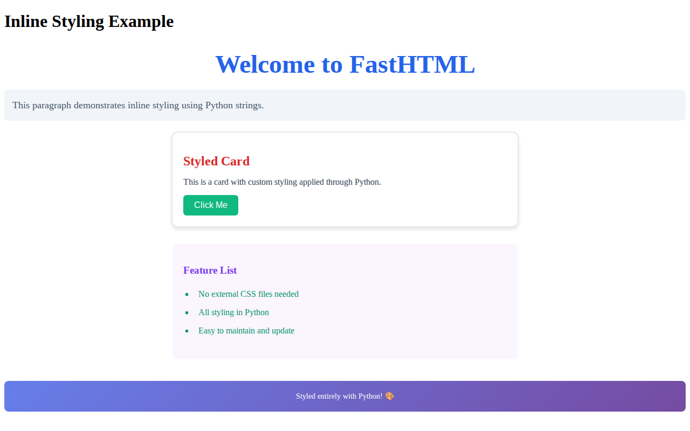
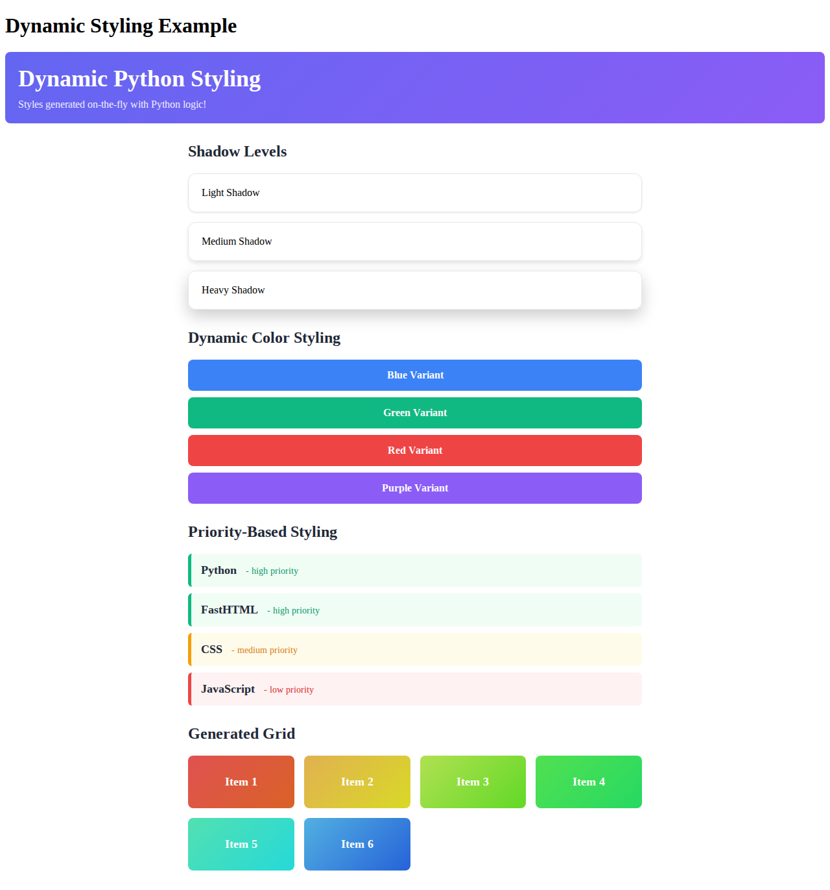
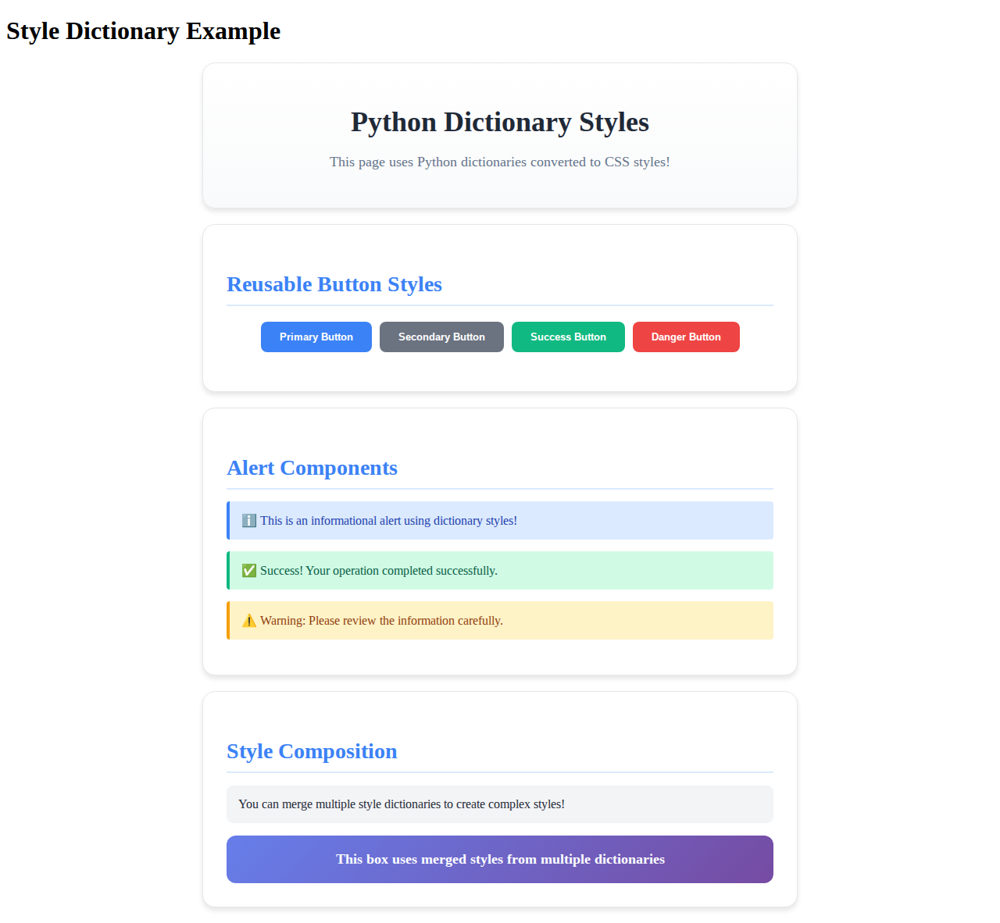
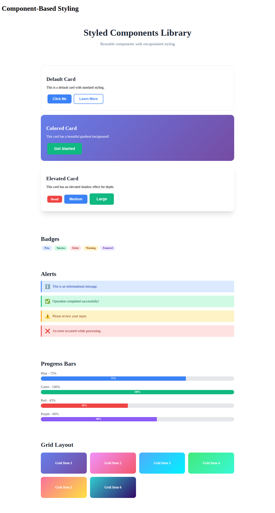
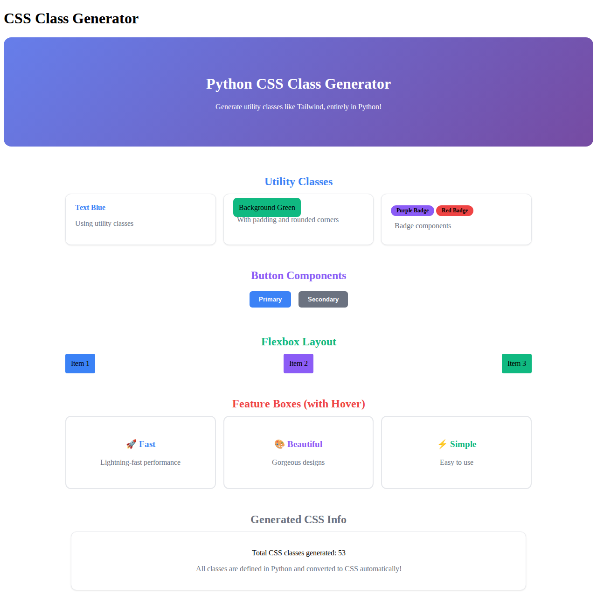

# FastHTML Python-Based Styling Research

This repository contains comprehensive research and experiments on using **FastHTML** for web development with a focus on **Python-based styling** approaches, minimizing or eliminating the need for separate CSS files.

## Overview

FastHTML is a modern Python framework for building web applications using pure Python code. One of its key features is the ability to handle all styling directly in Python, without needing separate CSS or HTML files.

## Experiments

### 1. Inline Styles (`01_inline_styles.py`)

**Demonstrates**: Direct inline styling using Python strings

**Key Features**:
- Apply styles directly to components using the `style` parameter
- No external CSS files needed
- Full control over individual element styling
- Great for quick prototyping and unique element styles

**Example**:
```python
H1("Welcome", style="color: #2563eb; font-size: 48px; text-align: center;")
Button("Click Me", style="background-color: #10b981; color: white; padding: 10px 20px;")
```

**Best For**:
- Unique, one-off styling
- Quick prototypes
- Component-specific visual tweaks

**Screenshot**:



---

### 2. Global Styles (`02_global_styles.py`)

**Demonstrates**: Using the `Style` component for site-wide CSS rules

**Key Features**:
- Define global CSS as Python strings
- Use CSS classes for consistent styling
- Passed to `fast_app()` via the `hdrs` parameter
- Traditional CSS syntax within Python

**Example**:
```python
global_css = Style("""
    .card {
        background: white;
        padding: 30px;
        border-radius: 16px;
    }

    .button-primary {
        background: #3b82f6;
        color: white;
    }
""")

app, rt = fast_app(hdrs=[global_css])
```

**Best For**:
- Consistent theming across multiple pages
- When you need CSS features like pseudo-classes (`:hover`)
- Large applications with reusable styles

**Screenshot**:


---

### 3. Dynamic Styles (`03_dynamic_styles.py`)

**Demonstrates**: Generating styles dynamically using Python logic

**Key Features**:
- Style generation based on runtime data
- Python functions that return style strings
- Conditional styling based on application state
- Parametric design systems

**Example**:
```python
def create_color_style(color, intensity=500):
    colors = {
        'blue': '#3b82f6',
        'green': '#10b981',
    }
    return f"background-color: {colors[color]}; padding: 15px;"

# Use it dynamically
Div("Content", style=create_color_style('blue'))
```

**Best For**:
- Data-driven styling
- Theming systems
- User preferences
- Dynamic color schemes

**Screenshot**:



---

### 4. Style Dictionaries (`04_style_dictionaries.py`)

**Demonstrates**: Using Python dictionaries for structured style management

**Key Features**:
- Define styles as Python dictionaries
- Convert dictionaries to CSS strings
- Easy to merge and compose styles
- Type-safe and IDE-friendly
- Better organization and reusability

**Example**:
```python
BUTTON_STYLE = {
    'background-color': '#3b82f6',
    'color': 'white',
    'padding': '12px 24px',
    'border-radius': '8px',
}

def dict_to_style(style_dict):
    return "; ".join(f"{k}: {v}" for k, v in style_dict.items()) + ";"

Button("Click", style=dict_to_style(BUTTON_STYLE))
```

**Best For**:
- Large style systems
- When you want Python data structures for styles
- Easier refactoring and maintenance
- Style composition and merging

**Screenshot**:



---

### 5. Component-Based Styling (`05_component_styling.py`)

**Demonstrates**: Creating reusable styled components with encapsulated styling

**Key Features**:
- Build a component library with built-in styles
- Variants and size options
- Encapsulated styling logic
- Consistent design system

**Example**:
```python
class StyledComponents:
    @staticmethod
    def Card(title, *children, variant='default'):
        variants = {
            'default': {'background': 'white'},
            'colored': {'background': 'linear-gradient(...)'},
        }
        style = variants[variant]
        return Div(H3(title), *children, style=...)

    @staticmethod
    def Button(text, variant='primary', size='medium'):
        # ... styling logic
        return Button(text, style=...)

# Usage
StyledComponents.Card("Title", P("Content"), variant='colored')
```

**Best For**:
- Design systems
- Component libraries
- Team consistency
- Reusable UI elements

**Screenshot**:



---

### 6. CSS Class Generator (`06_css_class_generator.py`)

**Demonstrates**: Programmatically generating CSS utility classes (Tailwind-like)

**Key Features**:
- Generate utility classes from Python code
- Create your own utility framework
- Tailwind-like approach, fully in Python
- Custom class generation logic

**Example**:
```python
class CSSGenerator:
    def __init__(self):
        self.classes = {}

    def add_class(self, name, **styles):
        self.classes[name] = styles

    def add_utility_classes(self):
        colors = {'blue': '#3b82f6', 'green': '#10b981'}
        for name, color in colors.items():
            self.add_class(f'text-{name}', color=color)

    def to_css(self):
        # Convert to CSS string

css_gen = CSSGenerator()
css_gen.add_utility_classes()
app, rt = fast_app(hdrs=[css_gen.get_style_tag()])

# Usage
Div("Text", cls="text-blue bg-green rounded")
```

**Best For**:
- Building utility-first frameworks
- When you want Tailwind-like utilities
- Highly customizable design systems
- Programmatic style generation

**Screenshot**:



---

## Key Concepts

### 1. Inline Styling with `style` Parameter

Every FastHTML component accepts a `style` parameter:

```python
Div("Content", style="color: red; padding: 10px;")
```

### 2. Global Styles with `Style` Component

The `Style` component creates global CSS rules:

```python
Style("""
    .my-class { color: blue; }
""")
```

Pass it to your app via `hdrs`:

```python
app, rt = fast_app(hdrs=[Style(...)])
```

### 3. CSS Classes with `cls` Parameter

Use the `cls` parameter to assign CSS classes:

```python
Div("Content", cls="card primary")
```

### 4. Python Functions for Style Generation

Create functions that return style strings:

```python
def button_style(color='blue'):
    return f"background: {color}; padding: 10px;"

Button("Click", style=button_style('red'))
```

### 5. Dictionary-Based Styles

Use dictionaries for better organization:

```python
style_dict = {'color': 'red', 'padding': '10px'}
style_str = "; ".join(f"{k}: {v}" for k, v in style_dict.items())
```

---

## Comparison: When to Use Each Approach

| Approach | Best Use Case | Complexity | Reusability | Performance |
|----------|--------------|------------|-------------|-------------|
| **Inline Styles** | Quick prototypes, unique elements | Low | Low | Good |
| **Global Styles** | Site-wide theming, CSS features | Medium | High | Excellent |
| **Dynamic Styles** | Data-driven designs, user preferences | Medium | Medium | Good |
| **Style Dictionaries** | Large style systems, maintainability | Medium | High | Good |
| **Styled Components** | Design systems, component libraries | High | Very High | Good |
| **CSS Class Generator** | Utility frameworks, Tailwind-like | High | Very High | Excellent |

---

## Advantages of Python-Based Styling

1. **Single Language**: Everything in Python - no context switching
2. **Dynamic Generation**: Generate styles based on data/logic
3. **Type Safety**: Leverage Python's type system for styles
4. **Code Reuse**: Use functions, classes, and modules for styles
5. **Testing**: Test your styling logic with Python tests
6. **IDE Support**: Full autocomplete and refactoring support
7. **No Build Step**: No CSS preprocessors or build tools needed
8. **Programmatic Control**: Full power of Python for styling

---

## Disadvantages & Considerations

1. **Performance**: Very large inline styles may increase HTML size
2. **Caching**: External CSS files can be cached by browsers
3. **Learning Curve**: Developers familiar with CSS may need adjustment
4. **CSS Features**: Some advanced CSS features easier with traditional CSS
5. **Browser DevTools**: Inline styles are harder to debug than external CSS

---

## Best Practices

### 1. **Choose the Right Approach for the Job**
- Use **inline styles** for unique, one-off elements
- Use **global styles** for site-wide theming and CSS features
- Use **style dictionaries** for maintainable style management
- Use **components** for reusable UI elements

### 2. **Combine Approaches**
```python
# Global base styles
global_css = Style(".card { padding: 20px; }")

# Component with inline override
Div("Special", cls="card", style="background: red;")
```

### 3. **Organize Styles in Modules**
```python
# styles.py
COLORS = {
    'primary': '#3b82f6',
    'secondary': '#6b7280',
}

BUTTON_STYLES = {
    'primary': {'background': COLORS['primary']},
}
```

### 4. **Use Constants for Consistency**
```python
# design_tokens.py
SPACING = {
    'xs': '4px',
    'sm': '8px',
    'md': '16px',
    'lg': '24px',
}

COLORS = {
    'primary': '#3b82f6',
    'success': '#10b981',
}
```

### 5. **Create Helper Functions**
```python
def padding(size='md'):
    sizes = {'sm': '8px', 'md': '16px', 'lg': '24px'}
    return f"padding: {sizes[size]};"

def margin(size='md'):
    sizes = {'sm': '8px', 'md': '16px', 'lg': '24px'}
    return f"margin: {sizes[size]};"
```

---

## Running the Experiments

### Setup with Pixi

This project uses [Pixi](https://pixi.sh) for package management. Pixi automatically creates an isolated environment with all dependencies.

```bash
# Install pixi (if not already installed)
curl -fsSL https://pixi.sh/install.sh | bash

# Install dependencies (creates .pixi/envs/default as the virtual environment)
pixi install

# Install Playwright browsers (needed for screenshot generation)
pixi run install-playwright
```

### Run Individual Experiments

```bash
# Run inline styles example
pixi run python 01_inline_styles.py

# Run global styles example
pixi run python 02_global_styles.py

# Run dynamic styles example
pixi run python 03_dynamic_styles.py

# Run style dictionaries example
pixi run python 04_style_dictionaries.py

# Run component styling example
pixi run python 05_component_styling.py

# Run CSS class generator example
pixi run python 06_css_class_generator.py
```

Each will start a local server (typically at `http://localhost:5001`).

### Generate Screenshots

To regenerate the screenshots for all experiments:

```bash
pixi run python capture_screenshots.py
```

This will automatically start each experiment server, capture a screenshot, and save it to the `screenshots/` directory.

---

## Recommended Patterns

### Pattern 1: Hybrid Approach (Global + Inline)

```python
# Define global styles for common patterns
global_css = Style("""
    .container { max-width: 1000px; margin: 0 auto; }
    .btn { padding: 10px 20px; border-radius: 8px; }
""")

app, rt = fast_app(hdrs=[global_css])

@rt('/')
def get():
    return Div(
        # Use class for common styling
        Button("Standard", cls="btn"),
        # Override with inline for uniqueness
        Button("Special", cls="btn", style="background: linear-gradient(...)"),
        cls="container"
    )
```

### Pattern 2: Component Library Approach

```python
# Create a reusable component library
class UI:
    @staticmethod
    def Button(text, variant='primary'):
        # Encapsulated styling
        ...

    @staticmethod
    def Card(title, *children):
        # Encapsulated styling
        ...

# Use throughout your app
@rt('/')
def get():
    return Div(
        UI.Card("Title", P("Content")),
        UI.Button("Click Me", variant='success')
    )
```

### Pattern 3: Design System with Tokens

```python
# design_system.py
class DesignTokens:
    COLORS = {
        'primary': '#3b82f6',
        'secondary': '#6b7280',
    }

    SPACING = {
        'xs': '4px', 'sm': '8px', 'md': '16px',
    }

    @classmethod
    def color_style(cls, color_name):
        return f"color: {cls.COLORS[color_name]};"

    @classmethod
    def spacing_style(cls, size):
        return f"padding: {cls.SPACING[size]};"

# Use in your app
Div("Content", style=DesignTokens.color_style('primary'))
```

---

## Additional Resources

- [FastHTML Official Documentation](https://www.fastht.ml/)
- [FastHTML Styling Guide](https://www.danliden.com/notebooks/web_dev/fasthtml/2_styling.html)
- [FastHTML Examples](https://gist.github.com/jph00/f1cfe4f94a12cb4fd57ad7fc43ebd1d0)

---

## Conclusions

FastHTML provides powerful options for Python-based styling:

1. **Flexibility**: Multiple approaches to fit different needs
2. **Python-First**: Leverage Python's full power for styling
3. **No Separate CSS**: Keep everything in one language
4. **Dynamic Capabilities**: Generate styles programmatically
5. **Reusability**: Build component libraries and design systems

The choice of approach depends on your project's:
- **Size**: Small projects → inline styles; Large projects → components/utilities
- **Team**: Solo → any approach; Teams → design systems and components
- **Requirements**: Static design → global styles; Dynamic → Python functions
- **Maintenance**: Long-term projects benefit from structured approaches

**Recommended Starting Point**: Begin with a combination of global styles for common patterns and inline styles for specific tweaks. As your project grows, migrate to styled components or a utility class generator.

---

## Future Exploration

Potential areas for further research:

1. **CSS-in-JS Integration**: Explore if libraries like styled-components could integrate
2. **Animation Systems**: Python-based animation and transition utilities
3. **Theme Switching**: Dynamic theme systems with Python
4. **Performance Benchmarks**: Compare different styling approaches
5. **Build Tools**: Create tools to optimize Python-based styles
6. **Design Tool Integration**: Convert Figma/Sketch designs to Python styles

---

**Last Updated**: 2025-11-12
**Python Version**: 3.11+
**FastHTML Version**: 0.12.33
